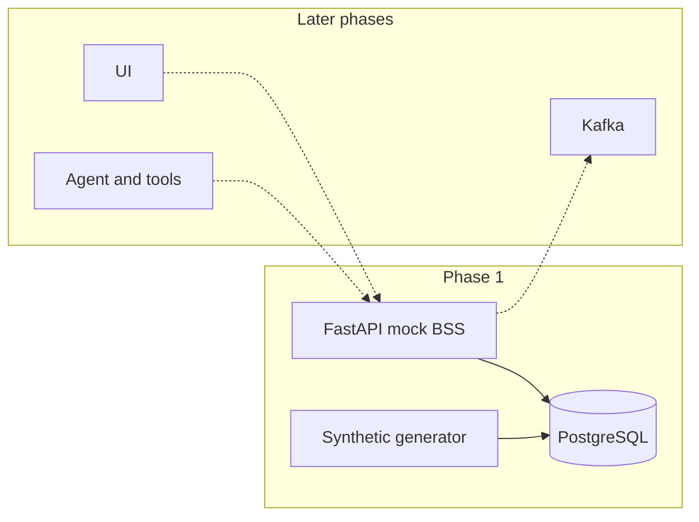

# BillPilot

BillPilot is an AI copilot for telecom billing and operations. Phase 1 is the mock billing system it will sit on: a PostgreSQL ledger of synthetic customers, and a FastAPI service whose resources are shaped like TM Forum Open APIs.

There is no model, no message broker, and no user interface yet. Those land in later phases. The seams are already named: an event publisher, an approval queue for money and service changes, and persona-scoped APIs.

## Synthetic data only

Every customer, bill, payment, and fault in this repository is generated. Nothing here is a real subscriber, a real invoice, or a vendor's product. Do not add operator data, vendor source, or internal product names. The generator uses public telecom ideas (plans, usage, GST, collections) and the `en_IN` Faker locale.

This API is a **learning mock**. It is not a certified or conformant TM Forum implementation. The paths and resource names follow the Open APIs closely enough that a later assistant can call them as tools. The payloads are a readable subset, not the full specification.

## Architecture



The database is the system of record. The API translates internal words (`issued`, `posted`, `soft_bar`) into TMF-like words (`sent`, `done`, a trouble-ticket status). Writes that move money start as `pending_approval`. A different role applies them. Every write is appended to `audit_log`.

## Quickstart

Requirements: Docker, and for tests a local Python 3.12.

```bash
docker compose up --build
```

That starts Postgres, runs migrations, and seeds 500 customers across 6 months. The API is at <http://localhost:8000/docs>.

Persona keys (local demo defaults, also in `.env.example`):

| Persona | Header | Sees |
| --- | --- | --- |
| Customer `CUST-000001` | `X-API-Key: dev-customer-key` | That customer's accounts |
| CSR `CSR-A` | `X-API-Key: dev-csr-key` | Accounts assigned to CSR-A |
| Ops | `X-API-Key: dev-ops-key` | Every account, and approvals |

```bash
curl -s -H 'X-API-Key: dev-customer-key' \
  'http://localhost:8000/tmf-api/customerBillManagement/v4/customerBill?limit=2'
```

Copy `.env.example` to `.env` to change the seed, the customer count, or the keys. Compose reads those variables. The database host inside Compose is `postgres`; do not point `DATABASE_URL` at `localhost` for the containers.

Seed again after changing the counts:

```bash
docker compose run --rm seed
```

`docker compose up` does not re-seed once the seed container has already exited successfully. The API container only migrates on startup, so a restart does not wipe the ledger.

Ground truth for the planted faults is written to `data/ground_truth.json` (gitignored).

### Tests

```bash
pip install -e ".[dev]"
make test
```

`make test` starts Postgres, creates a database named `billpilot_test`, then runs ruff and pytest. Tests refuse any other database name.

## API

All TMF-shaped routes are under `/tmf-api`. Lists accept `offset` and `limit` (default 20, max 100) and return `X-Total-Count` and `X-Result-Count`.

| Method | Path | Who can call it |
| --- | --- | --- |
| GET | `/customerBillManagement/v4/customerBill` | customer, csr, ops, within scope |
| GET | `/customerBillManagement/v4/appliedCustomerBillingRate` | same |
| GET, POST | `/customerBillManagement/v4/customerBillDispute` | read: all three; create: customer, csr |
| GET, POST | `/customerBillManagement/v4/billAdjustment` | read: all three; propose: csr only |
| POST | `/customerBillManagement/v4/billAdjustment/{id}/approve` | ops, and not the proposer |
| GET | `/usageManagement/v4/usage` | all three, within scope |
| GET | `/productCatalogManagement/v4/productOffering` | any authenticated role |
| GET | `/paymentManagement/v4/payment` | all three, within scope |
| GET | `/paymentManagement/v4/paymentAttempt` | same; a small extension so an unposted payment stays visible |
| GET | `/productInventory/v4/product` | subscription, VAS, and entitlement |
| GET, POST | `/troubleTicket/v4/troubleTicket` | read: all three; create: customer, csr |
| GET | `/prepayBalanceManagement/v4/bucket` | TMF654-style balance |
| GET | `/ops/auditLog` | ops |
| GET | `/health` | public |

Filters use dotted names where the Open API does: `billingAccount.id`, `billNo`, `billDate.gte`, `usageType`, `product.id`.

A proposed adjustment does not change the bill. `decision=approve` applies it in one transaction. `decision=reject` leaves the bill alone. Approving twice returns 409.

Asking for an account outside your scope returns 403, including when the id exists. A missing id returns 404. That is a deliberate, documented trade-off: the mock prefers a clear "not your account" over hiding existence.

## What the generator plants

Default seed `42`, 500 customers, 6 months, **92 labelled anomalies** across 23 types. Counts are `ANOMALY_COUNTS` as JSON, or `GeneratorConfig` in code. Tests use one of each type and 48 customers.

| Type | Default count |
| --- | --- |
| double_charge | 6 |
| roaming_spike | 4 |
| wrong_rate | 6 |
| missed_discount | 6 |
| charge_after_cancellation | 4 |
| vas_not_opted_in | 4 |
| payment_not_recorded | 4 |
| payment_not_posted | 4 |
| unbilled_usage | 6 |
| duplicate_usage | 6 |
| sim_swap | 3 |
| barred_after_paying | 3 |
| treated_during_open_dispute | 3 |
| payment_not_ending_treatment | 3 |
| promise_to_pay_ignored | 3 |
| exempt_account_treated | 3 |
| addon_never_activated | 4 |
| allowance_not_reset | 4 |
| overlapping_packs_double_counted | 3 |
| overlapping_packs_dropped | 3 |
| promo_ended_early | 3 |
| feature_active_after_cancellation | 3 |
| overage_on_covered_usage | 4 |

Five healthy controls are also labelled in the same file: an unpaid account on the correct ladder, an exemption that is respected, a dispute that holds treatment, a promise that is honoured, and a failed autopay that is later posted. They are not faults.

Apart from those faults, invoices balance: line amounts sum to the total, tax is 18% of the pre-tax subtotal, and amount due is the total minus posted payments. Currency is INR.

### Billing simplifications worth saying out loud

- One GST line at 18%. Not split into CGST and SGST.
- The generator builds one account and one subscription per customer. The schema allows more.
- Applying a credit does not recompute GST. The tax line stays; the adjustment line is signed so the lines still sum to the new total.
- Crediting an already-paid bill reduces the total and can leave amount due at zero. It does not create a cash refund.
- The collections ladder is reminder at 3 days past due, soft bar at 10, hard bar at 20, disconnect at 45.
- The clock inside the generator is 1 October 2026. It does not read the wall clock. Live API writes do.
- Rate limits are counted in this process only. They are not shared across replicas.

## Decisions

Short notes on why the obvious alternatives were not taken live in [docs/decisions](docs/decisions).

## Deferred

- The assistant itself: tools, retrieval, guardrails, tracing, and an evaluation set.
- Kafka (or Redpanda) and a consumer for failed downstream work. `NullPublisher` is the stand-in. Topics already named: `usage.rated`, `bill.run`, `payment.events`, `treatment.actions`, `entitlement.changes`, `system.errors`.
- Dashboards, onboarding, and bulk migration.
- A user interface.
- Certified TM Forum conformance, late fees, split GST, and multi-replica rate limits.
